AudioVisualizer
======
**This project was primarily created for the ReVox A700 reel2reel tape recorder, but can also be used in general.**
Copyright (C) 2021 by DIYLAB <https://www.diylab.de>

Actually, the project is meant to replace the analog pointer instrument of the ReVox A700 with a TFT display. However, the field of application is not limited to this! Analog VU meters, RMS and PPM meters, spectrum analysis, goniometer and correlation are displayed. The appearance of the individual modules can be set in detail with an extra tool and also all workspaces (see below). 

**There will also be the PCB for the project and a schematic here soon.**

The project needs your help, there are still many to do.
A todo list will also come in the next days. i am very grateful for help. 

#### These components are required as a minimum

* Teensy 4.0 (recommended) or Teensy 4.1
* Audio Adaptor Board for Teensy 4.x Rev D
* TFT display with ILI9341 controller and a resolution of 320x240 px

[3.2inch SPI Module ILI9341 SKU:MSP3218](http://www.lcdwiki.com/3.2inch_SPI_Module_ILI9341_SKU:MSP3218)
[2.8inch SPI Module ILI9341 SKU:MSP2807](http://www.lcdwiki.com/2.8inch_SPI_Module_ILI9341_SKU:MSP2807)
[2.4inch SPI Module ILI9341 SKU:MSP2402](http://www.lcdwiki.com/2.4inch_SPI_Module_ILI9341_SKU:MSP2402)

Many other displays are also possible if they have the required connectors, have the ILI9341 controller and a resolution of 320x240 px.

#### Display connection diagram

| Display        | Teensy                                            |
| -------------- | ------------------------------------------------- |
| VCC            | 3.3V (from Teensy, better 3.3V from separate LDO) |
| GND            | GND (top, between Vin and 3.3V)                   |
| CS             | 9                                                 |
| RESET          | 6                                                 |
| DC/RS          | 10                                                |
| SDI (**MOSI**) | 11                                                |
| SCK            | 13                                                |
| LED            | 5                                                 |
| SDO (**MISO**) | 12                                                |

If the display is operated with 3.3V, which is the case in this project, then the jumper **J1** on the display must be closed!

#### Connection of the pushbutton

| Button                                | Teensy |
| ------------------------------------- | ------ |
| Pushbutton between Teensy PIN and GND | 0      |

#### Connection of the infrared receiver "Vishay TSOP 4838"

| TSOP 4838   | Teensy                          |
| ----------- | ------------------------------- |
| 1 (**OUT**) | 4                               |
| 2 (**GND**) | GND (top, between Vin and 3.3V) |
| 3 (**VS**)  | 3.3V                            |

#### Used libraries

Optimized ILI9341 screen driver library for Teensy 4/4.1, with vsync and differential updates: <https://github.com/vindar/ILI9341_T4>
TGX - a tiny/teensy graphics library: <https://github.com/vindar/tgx>
Arduino OneButton Library: <https://github.com/mathertel/OneButton> (install via the Arduino library manager)
IRremote Arduino Library: <https://github.com/Arduino-IRremote/Arduino-IRremote>
TeensyID: https://github.com/sstaub/TeensyID

#### Used development software

Arduino IDE 1.8.15
Teensyduino, Version 1.54
[optional: Microsoft Visual Studio Community 2019 + Visual Micro - Release 21.06.06.17]

#### All screenshots were transferred <u>directly</u> from the display

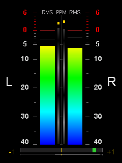 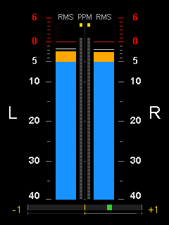 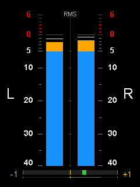

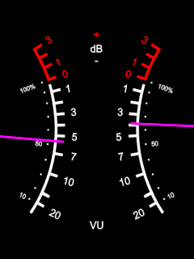 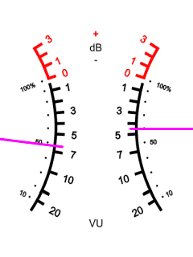 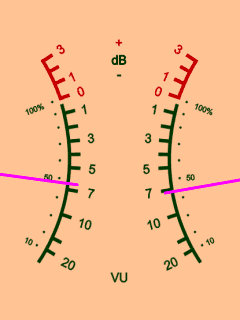

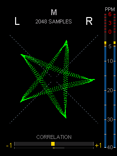 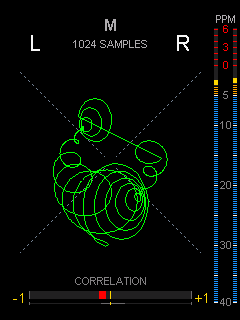 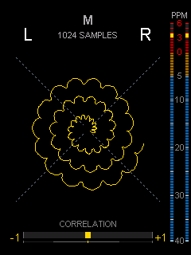

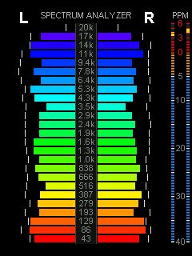  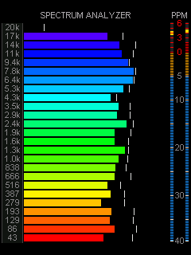

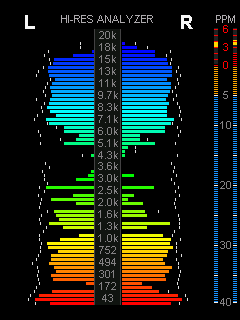  

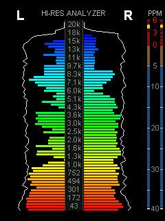 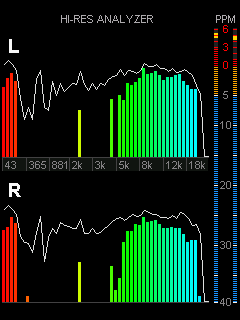 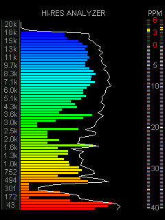

#### Accessories

The **ConfigTool** directory contains a Windows desktop configuration program for conveniently setting all modes, colors and calibrations. Furthermore, the infrared remote control can be set and screenshots directly from the display are also possible.
No installation is required and no system changes are made. Runs on all 64Bit systems from Windows7 to Windows10 (also server).

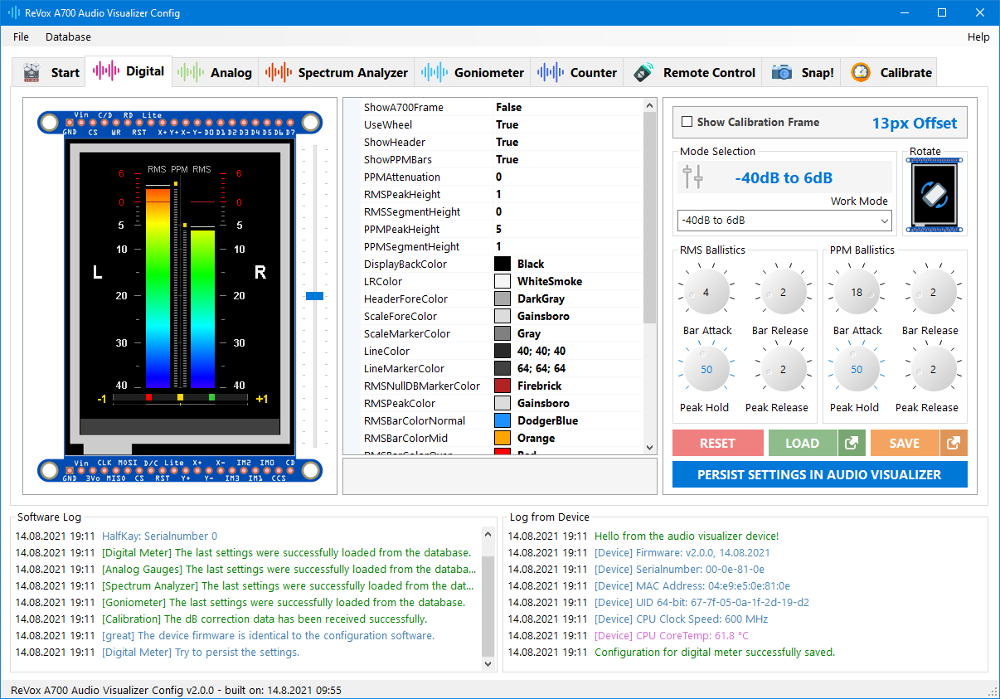

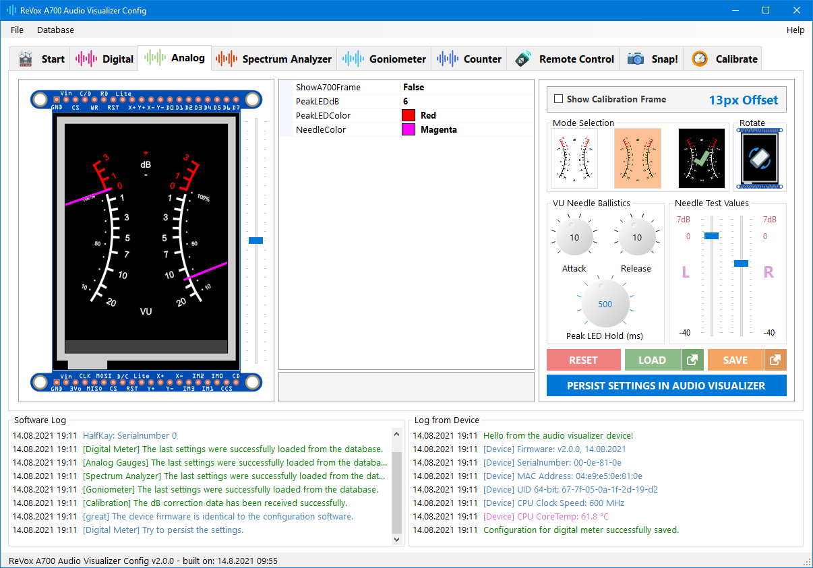

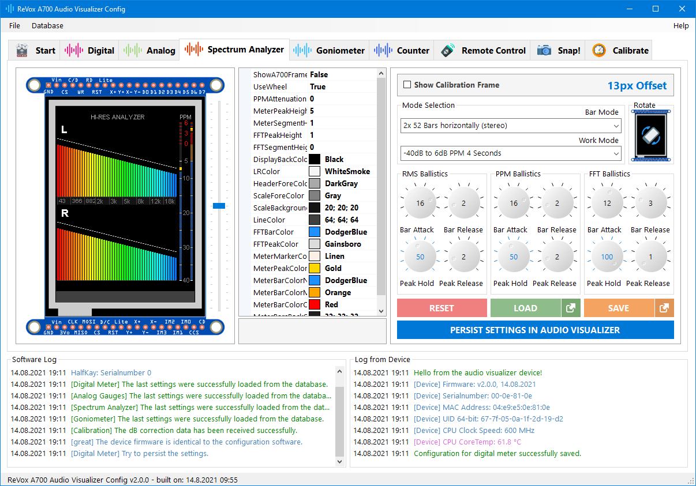

